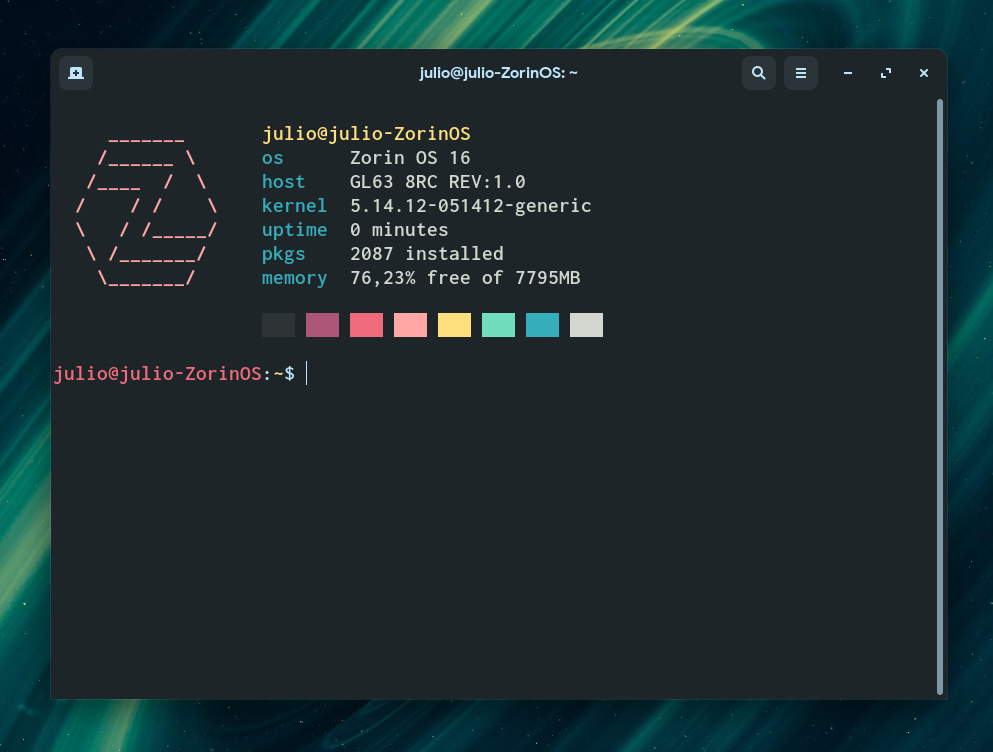

# manjarofetch

An extremely lightweight neofetch-like bash script, designed for Manjaro Linux.



## Install

Download, unzip and move the file "manjarofetch" to the /usr/bin directory.
```
sudo mv manjarofetch /usr/bin
```
```
manjarofetch
```
You may now add it to your bashrc so it shows up whenever you open a terminal.
```
echo -e "manjarofetch\n" >> .bashrc
```
